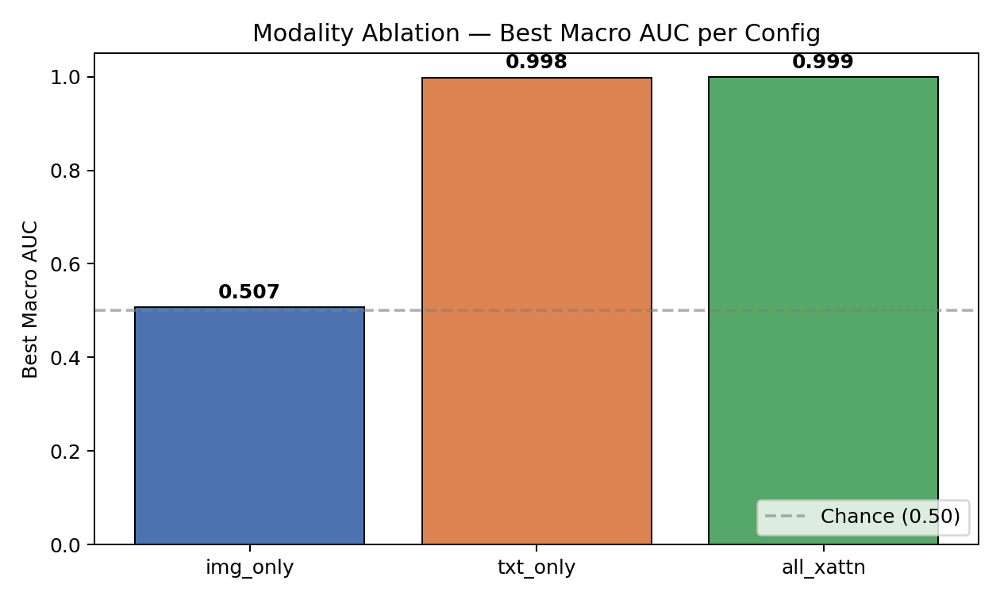
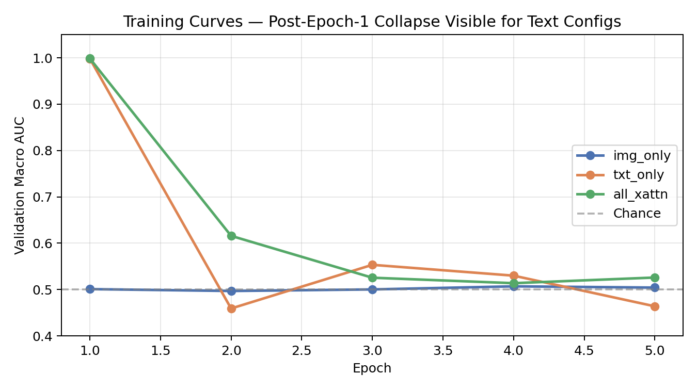
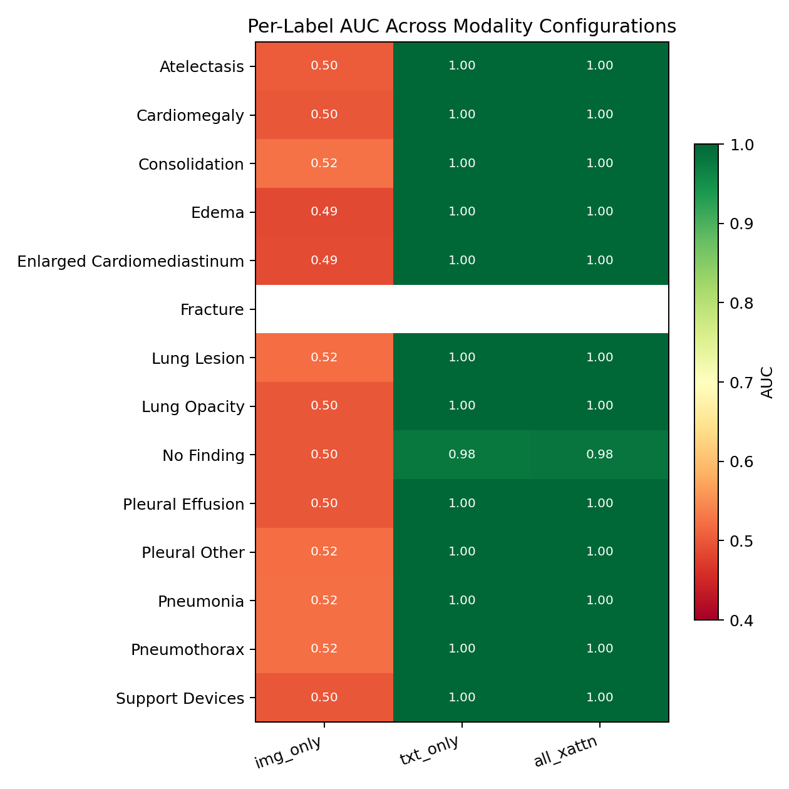

# 3-Config Ablation Results

## Setup

| Item | Value |
|---|---|
| Train subset | 20,000 CheXpert images (random sample, seed 42) |
| Val set | 234 official CheXpert valid.csv |
| Epochs | 5 |
| Batch size | 16 |
| Optimizer | AdamW (lr=1e-4, wd=1e-2) |
| Mixed precision | AMP fp16 |
| Hardware | Kaggle T4 ×2 |
| Notes/vitals | Synthetic (label-conditional) |

## Headline Table — Best Macro Metrics

| Config | Modalities | Fusion | Best Macro AUC | Best Macro AP | Best Epoch | Time |
|---|---|---|---|---|---|---|
| `img_only`  | image | — | **0.5069** | 0.211 | 4 | 17.2 min |
| `txt_only`  | text  | — | **0.9983** | 0.917 | 1 | 22.5 min |
| `all_xattn` | image + text + vitals | cross-attention | **0.9986** | 0.918 | 1 | 40.6 min |



## Key Findings

### 1. Synthetic notes provide a near-perfect shortcut
Both text-using configs reach ~1.0 macro AUC at epoch 1. Per-label AUCs are 1.00 on 12 of 14 classes, exposing the label-conditional structure of synthetically generated notes.

### 2. Image branch did not learn under this configuration
`img_only` stays at chance (0.50–0.51) across all 5 epochs and across all 14 labels. Likely causes (in order of likelihood):

- **5 × 20 k samples ≈ 6,250 optimizer steps** — too few to fine-tune ViT-Base (86 M params) from ImageNet-21k weights to a domain-shifted multilabel task.
- **LR 1e-4 is ~3× the standard ViT fine-tuning rate** (typically 3e-5 with cosine schedule).
- No LR warmup or decay, no early stopping criteria.

### 3. Post-epoch-1 collapse on text configs
Both `txt_only` and `all_xattn` peak at epoch 1 then collapse to 0.46–0.62 by epoch 5:

```
txt_only :  0.998 → 0.459 → 0.553 → 0.530 → 0.464
all_xattn:  0.999 → 0.616 → 0.526 → 0.514 → 0.526
```



This is classic AMP + high-LR instability: once the model saturates the easy text shortcut at epoch 1, fp16 gradient overflows and a too-aggressive LR push it off the optimum. Standard fixes (linear warmup → cosine decay, gradient clipping, lower LR) were **not** applied in this preliminary run.

### 4. Per-label heatmap



Image-only is at chance for every label; text-using configs are at 1.0 for every label except `No Finding` (slightly lower at 0.98). `Fracture` is NaN due to zero positives in the 234-image validation split.

## What This Tells Us

- The **deployed dashboard model** (epoch 1 of the original 10-epoch run, AUC 0.9986) is operating near the peak of this training regime — fortunate consequence of "save best checkpoint by validation AUC".
- **Real MIMIC-III notes** would not encode labels and would force the image branch to contribute. Until then, ablation numbers are bounded by the synthetic-shortcut ceiling.
- **For a publishable ablation**, this run should be reproduced with:
  - LR 3e-5, linear warmup over first 10% of steps, cosine decay
  - Gradient clipping at norm 1.0
  - At least 10 epochs × 50k samples for `img_only`
  - Real MIMIC-III text once DUA arrives

## Files

| File | Contents |
|---|---|
| `ablation_results.csv` | Macro AUC/AP/time per config |
| `ablation_per_label.csv` | Per-label AUC × 3 configs |
| `ablation_full.json` | Full training history, raw metrics |
| `make_plots.py` | Generates the three PNGs in `plots/` |
| `plots/macro_auc_bar.png` | Headline bar chart |
| `plots/per_label_heatmap.png` | Per-label AUC heatmap |
| `plots/training_curves.png` | Multi-epoch validation curves |
